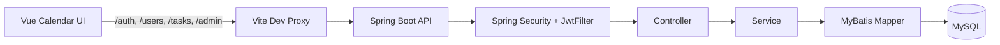
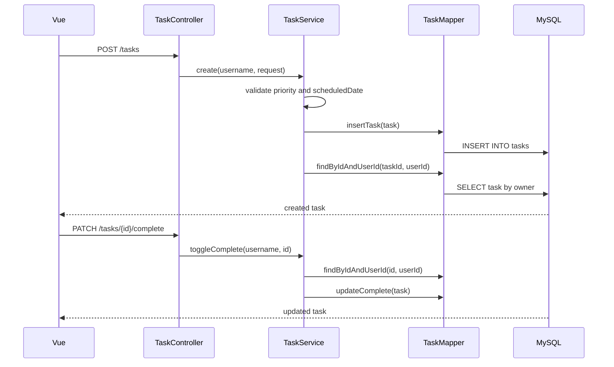
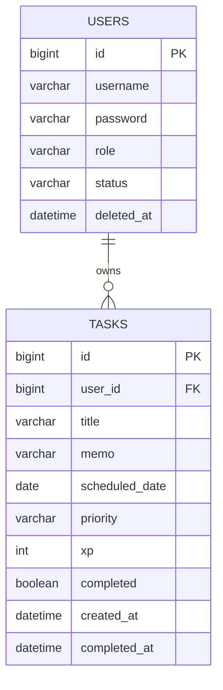

# Task Calendar Backend

Spring Boot와 MyBatis로 만든 개인 일정 관리 백엔드입니다. Vue 프론트엔드에서 로그인한 사용자가 날짜별 일정을 만들고, 완료 상태를 토글하고, 캘린더에 표시할 수 있도록 Task API를 제공합니다.

## Repositories

- Frontend: [vue-toy-frontend](https://github.com/yonghuun/vue-toy-frontend)
- Backend: [spring-toy-backend](https://github.com/yonghuun/spring-toy-backend)

## Overview

- JWT 기반 회원가입/로그인을 제공합니다.
- 로그인한 사용자별로 일정 Task를 분리해서 조회합니다.
- 일정은 `scheduledDate`, `title`, `memo`, `priority`, `completed` 정보를 가집니다.
- Task 수정/삭제/완료 토글은 항상 `taskId`와 현재 사용자의 `userId`를 함께 확인합니다.
- 관리자 계정은 사용자 목록 조회, 권한 변경, 삭제 처리, 복구를 할 수 있습니다.

## Architecture



## API Summary

| Method | Endpoint | Description |
| --- | --- | --- |
| POST | `/auth/signup` | 회원가입 |
| POST | `/auth/login` | 로그인 및 JWT 발급 |
| GET | `/users/me` | 현재 인증 사용자 확인 |
| GET | `/tasks` | 내 일정 목록 조회 |
| POST | `/tasks` | 일정 생성 |
| PATCH | `/tasks/{id}/complete` | 일정 완료 상태 토글 |
| DELETE | `/tasks/{id}` | 일정 삭제 |
| GET | `/admin/users` | 사용자 목록 조회 |
| PATCH | `/admin/users/{userId}/role` | 사용자 권한 변경 |
| DELETE | `/admin/users/{userId}` | 사용자 삭제 처리 |
| PATCH | `/admin/users/{userId}/restore` | 삭제 사용자 복구 |

## Task API

모든 Task API는 `Authorization: Bearer {token}` 헤더가 필요합니다.

### Create Task

```http
POST /tasks
Content-Type: application/json
Authorization: Bearer {token}
```

```json
{
  "title": "오전 회의 준비",
  "memo": "자료 확인",
  "scheduledDate": "2026-06-04",
  "priority": "NORMAL"
}
```

`priority` 허용값:

- `LOW`
- `NORMAL`
- `HIGH`

`scheduledDate`는 `yyyy-MM-dd` 형식이어야 합니다.

### Task Response

```json
{
  "id": 1,
  "title": "오전 회의 준비",
  "memo": "자료 확인",
  "scheduledDate": "2026-06-04",
  "priority": "NORMAL",
  "priorityLabel": "Normal",
  "xp": 35,
  "completed": false,
  "createdAt": "2026-06-04 21:00:00",
  "completedAt": null
}
```

## Task Flow



## Data Model



## Database

현재 `schema.sql` 기준 Task 테이블:

```sql
CREATE TABLE tasks (
    id BIGINT AUTO_INCREMENT PRIMARY KEY,
    user_id BIGINT NOT NULL,
    title VARCHAR(100) NOT NULL,
    memo VARCHAR(255),
    scheduled_date DATE NOT NULL,
    priority VARCHAR(20) NOT NULL,
    xp INT NOT NULL,
    completed BOOLEAN NOT NULL DEFAULT FALSE,
    created_at DATETIME NOT NULL,
    completed_at DATETIME NULL,
    FOREIGN KEY (user_id) REFERENCES users(id)
);
```

기존 `tasks` 데이터를 지우고 새 스키마로 다시 만들 때:

```sql
DROP TABLE IF EXISTS tasks;

CREATE TABLE tasks (
    id BIGINT AUTO_INCREMENT PRIMARY KEY,
    user_id BIGINT NOT NULL,
    title VARCHAR(100) NOT NULL,
    memo VARCHAR(255),
    scheduled_date DATE NOT NULL,
    priority VARCHAR(20) NOT NULL,
    xp INT NOT NULL,
    completed BOOLEAN NOT NULL DEFAULT FALSE,
    created_at DATETIME NOT NULL,
    completed_at DATETIME NULL,
    FOREIGN KEY (user_id) REFERENCES users(id)
);
```

## Setup

Create local config:

```text
src/main/resources/application.properties
```

Example:

```properties
spring.datasource.url=jdbc:mysql://localhost:3306/toy?serverTimezone=Asia/Seoul
spring.datasource.username=your_db_username
spring.datasource.password=your_db_password
```

Run backend:

```sh
./mvnw spring-boot:run
```

Run tests:

```sh
./mvnw test
```

Frontend dev server usually proxies API requests to:

```text
http://localhost:8080
```

## Learning Notes

- `Controller`는 HTTP 요청과 인증 객체를 받아 `Service`로 넘깁니다.
- `Service`는 현재 사용자 확인, 입력값 검증, 소유자 검증, 완료 상태 변경을 담당합니다.
- `Mapper`와 XML은 SQL과 DB 컬럼 매핑을 담당합니다.
- `Request DTO`는 프론트에서 들어오는 값만 받습니다.
- `Response DTO`는 프론트 캘린더에 필요한 값을 내려줍니다.
- `scheduledDate`는 캘린더 표시를 위한 핵심 필드입니다.

## Next

- 일정 수정 API 추가
- 날짜 범위별 Task 조회 API 추가
- JWT secret 설정 분리
- 테스트 코드 보강
