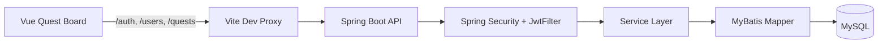
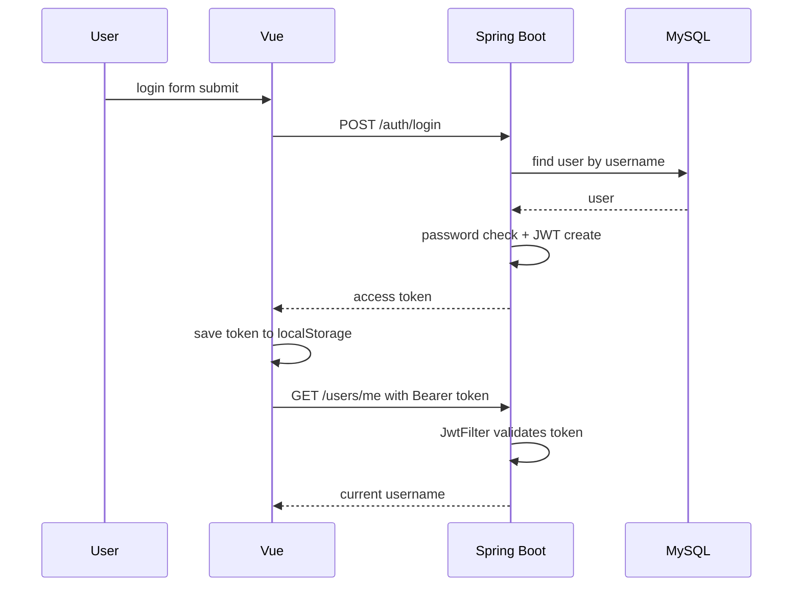
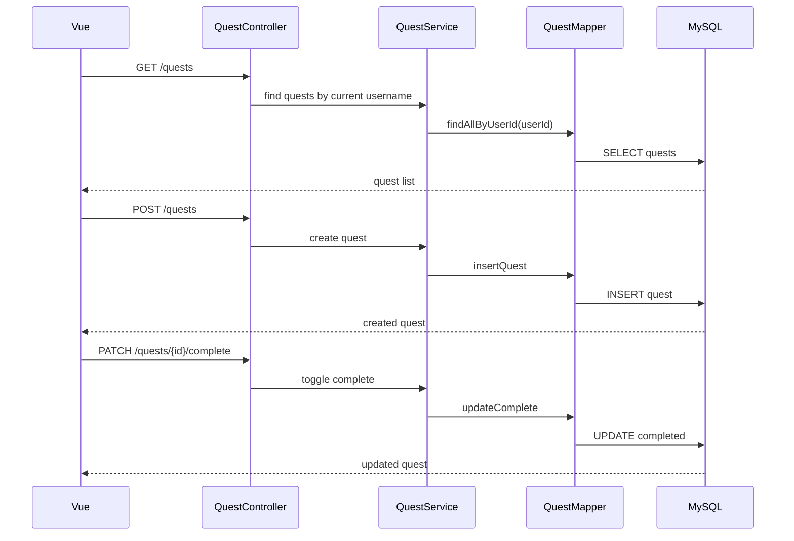
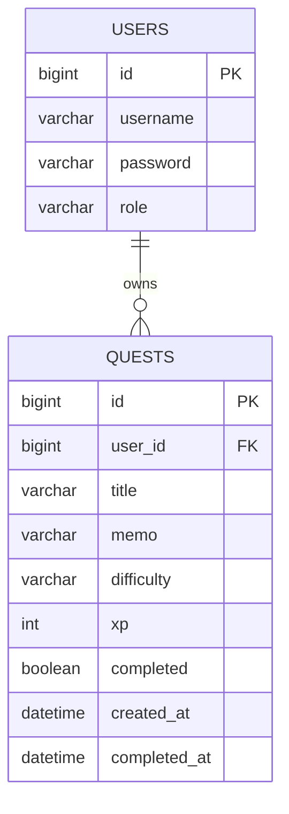

# Quest Board Toy Project

Vue 3 프론트엔드와 Spring Boot 백엔드를 분리해서 만들며 인증, JWT, 사용자별 Quest CRUD 흐름을 학습하는 토이 프로젝트입니다.

## Repositories

- Frontend: [vue-toy-frontend](https://github.com/yonghuun/vue-toy-frontend)
- Backend: [spring-toy-backend](https://github.com/yonghuun/spring-toy-backend)

## Overview

로그인한 사용자가 오늘의 미션을 추가하고, 완료한 작업을 기록으로 남기는 개인 Quest Board입니다.

- Vue에서 로그인/회원가입과 Quest Board 화면을 제공합니다.
- Spring Boot에서 인증, JWT 검증, 사용자별 Quest API를 제공합니다.
- MySQL에 사용자와 Quest 데이터를 저장합니다.
- 완료된 Quest는 화면의 "완료된 백엔드 연동" 영역으로 이동합니다.

## Architecture



## Auth Flow



## Quest Flow



## Tech Stack

| Area | Stack |
| --- | --- |
| Frontend | Vue 3, Vite, Vue Router |
| Backend | Java 17, Spring Boot 4, Spring Security |
| Auth | JWT, BCrypt |
| Database | MySQL |
| Persistence | MyBatis |

## Implemented Features

- 회원가입
  - `POST /auth/signup`
  - BCrypt 비밀번호 암호화
- 로그인
  - `POST /auth/login`
  - JWT access token 발급
- 보호 API
  - `GET /users/me`
  - `Authentication` 기반 현재 사용자 확인
- Quest API
  - `GET /quests`
  - `POST /quests`
  - `PATCH /quests/{id}/complete`
  - `DELETE /quests/{id}`
- Vue Quest Board
  - JWT 토큰 저장
  - 사용자별 Quest 조회
  - 미션 추가
  - 완료/미완료 토글
  - 삭제 전 확인
  - 완료된 Quest 기록 분리 표시

## API Summary

| Method | Endpoint | Description |
| --- | --- | --- |
| POST | `/auth/signup` | 회원가입 |
| POST | `/auth/login` | 로그인 및 JWT 발급 |
| GET | `/users/me` | 현재 인증 사용자 확인 |
| GET | `/quests` | 내 Quest 목록 조회 |
| POST | `/quests` | Quest 생성 |
| PATCH | `/quests/{id}/complete` | Quest 완료 상태 토글 |
| DELETE | `/quests/{id}` | Quest 삭제 |

## Data Model



## Frontend Setup

```sh
npm install
npm run dev
```

Frontend dev server:

```text
http://127.0.0.1:5173
```

Vite proxy forwards API requests to:

```text
http://localhost:8080
```

## Backend Setup

Create local config from the example file:

```text
src/main/resources/application.properties
```

Example values:

```properties
spring.datasource.url=jdbc:mysql://localhost:3306/toy?serverTimezone=Asia/Seoul
spring.datasource.username=your_db_username
spring.datasource.password=your_db_password
```

Run backend:

```sh
./mvnw spring-boot:run
```

Run tests:

```sh
./mvnw test
```

## Current Learning Notes

- `Controller`는 HTTP 요청/응답을 담당합니다.
- `Service`는 현재 사용자 확인, XP 계산, 소유자 검증 같은 비즈니스 흐름을 담당합니다.
- `Mapper`와 XML은 SQL과 DB 매핑을 담당합니다.
- `Request DTO`는 프론트에서 들어오는 값만 받습니다.
- `Response DTO`는 화면에 필요한 값만 내려줍니다.
- Quest 수정/삭제는 항상 `questId`와 `userId`를 함께 확인해야 합니다.

## Next Missions

- 백엔드 에러 응답 형식 통일
- Quest 입력값 검증 보강
- JWT secret 설정 분리
- 401 응답 시 프론트에서 로그인 화면으로 이동
- 사용자 XP/레벨 계산을 백엔드로 이전
